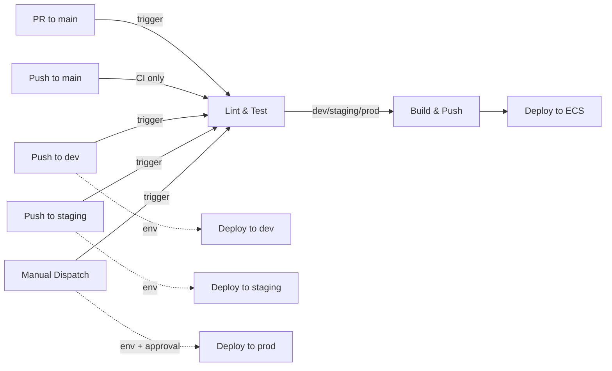

# CI/CD Pipeline Documentation

## Overview

The CI/CD pipeline is implemented as a GitHub Actions workflow (`.github/workflows/ci-cd.yml`). It automates code quality checks, Docker image builds, and deployments to AWS ECS Fargate across three environments: **dev**, **staging**, and **prod**.

## Pipeline Trigger Rules

| Trigger | What Runs |
|---------|-----------|
| Push to `main` | Lint & Test only (CI gate) |
| Pull request to `main` | Lint & Test only (CI gate) |
| Push to `dev` | Lint & Test → Build & Push → Deploy to **dev** |
| Push to `staging` | Lint & Test → Build & Push → Deploy to **staging** |
| Manual dispatch (workflow_dispatch) | Lint & Test → Build & Push → Deploy to **prod** (requires typing `yes` to confirm) |

## Pipeline Jobs

### Job 1: Lint & Test

**Runs on:** Every push and every pull request.
**Purpose:** Ensure code quality and correctness before any build or deploy.

| Step | Action | Details |
|------|--------|---------|
| Checkout code | `actions/checkout@v4` | Clones the repository |
| Set up Python | `actions/setup-python@v5` | Installs Python 3.11 with pip caching |
| Install dependencies | `pip install -r app/requirements.txt` | Installs Flask, gunicorn, pytest, flake8 |
| Run flake8 linter | `flake8 app/ --max-line-length=120` | Static analysis for style and syntax errors |
| Run pytest | `pytest app/tests/ -v --tb=short` | Runs unit tests for all endpoints (`/`, `/health`, `/ready`, 404) |

**Exit criteria:** All steps must pass. If linting or tests fail, the pipeline stops here.

---

### Job 2: Build & Push

**Runs on:** Only when pushing to `dev`, `staging`, or on manual dispatch for `prod`. Skipped for `main` pushes and pull requests.
**Depends on:** Job 1 (Lint & Test) must succeed.
**Environment:** Automatically resolved from the branch name (`dev`, `staging`) or `prod` for manual dispatch. This grants access to environment-specific GitHub Secrets.

| Step | Action | Details |
|------|--------|---------|
| Checkout code | `actions/checkout@v4` | Clones the repository |
| Configure AWS credentials | `aws-actions/configure-aws-credentials@v4` | Authenticates using `AWS_ACCESS_KEY_ID` and `AWS_SECRET_ACCESS_KEY` from environment secrets |
| Login to ECR | `aws-actions/amazon-ecr-login@v2` | Authenticates Docker to the ECR registry |
| Build Docker image | `docker build` | Builds the Flask app image from `app/Dockerfile` |
| Tag image | `docker tag` | Tags with commit SHA (`${{ github.sha }}`) and `latest` |
| Push to ECR | `docker push` | Pushes both tags to the ECR repository |

**Exit criteria:** Docker image is successfully pushed to ECR with both tags.

---

### Job 3: Deploy

**Runs on:** Only after a successful build & push.
**Depends on:** Job 2 (Build & Push) must succeed.
**Environment:** Same environment as Job 2 (passed via job outputs). For `prod`, GitHub Environment protection rules (required reviewer) can enforce manual approval before this job starts.

| Step | Action | Details |
|------|--------|---------|
| Configure AWS credentials | `aws-actions/configure-aws-credentials@v4` | Authenticates using environment-specific secrets |
| Deploy to ECS | `aws ecs update-service --force-new-deployment` | Tells ECS to pull the latest image and roll out new tasks |
| Wait for stability | `aws ecs wait services-stable` | Blocks until the ECS service has healthy tasks running the new image (up to 10 minutes) |

**Exit criteria:** ECS service reaches a steady state with all tasks running the new image. If the deployment fails, ECS circuit breaker automatically rolls back.

---

## Environment Resolution Logic

The pipeline determines which environment to target using this expression:

```yaml
environment: >-
  ${{
    github.event_name == 'workflow_dispatch' && 'prod' ||
    (github.ref == 'refs/heads/dev' && 'dev') ||
    (github.ref == 'refs/heads/staging' && 'staging')
  }}
```

This maps:
- `workflow_dispatch` → `prod`
- `refs/heads/dev` → `dev`
- `refs/heads/staging` → `staging`

## Required GitHub Secrets

Configure these in **GitHub repo → Settings → Environments** for each environment (`dev`, `staging`, `prod`):

| Secret | Description | Example |
|--------|-------------|---------|
| `AWS_ACCESS_KEY_ID` | IAM access key for deployments | `AKIA...` |
| `AWS_SECRET_ACCESS_KEY` | IAM secret key for deployments | `wJal...` |
| `AWS_REGION` | AWS region where infrastructure is deployed | `us-east-1` |
| `ECR_REPOSITORY` | ECR repository name | `people-assignment-dev` |
| `ECS_CLUSTER` | ECS cluster name | `people-assignment-dev-cluster` |
| `ECS_SERVICE` | ECS service name | `people-assignment-dev-service` |

## Pipeline Flow Diagram



## Rollback Strategy

- **Automatic:** ECS deployment circuit breaker is enabled with rollback. If new tasks fail health checks, ECS automatically reverts to the previous task definition.
- **Manual:** Push a revert commit to the environment branch, or re-tag a known-good image as `latest` in ECR and force a new deployment.

## Security Considerations

- AWS credentials are stored in GitHub Environment Secrets, never in code.
- Each environment has isolated secrets -- dev credentials cannot access prod resources.
- The `prod` environment should have a **required reviewer** protection rule, adding a human approval gate before deployment.
- The pipeline uses `id-token: write` permission for potential OIDC federation (can replace static keys in the future).
